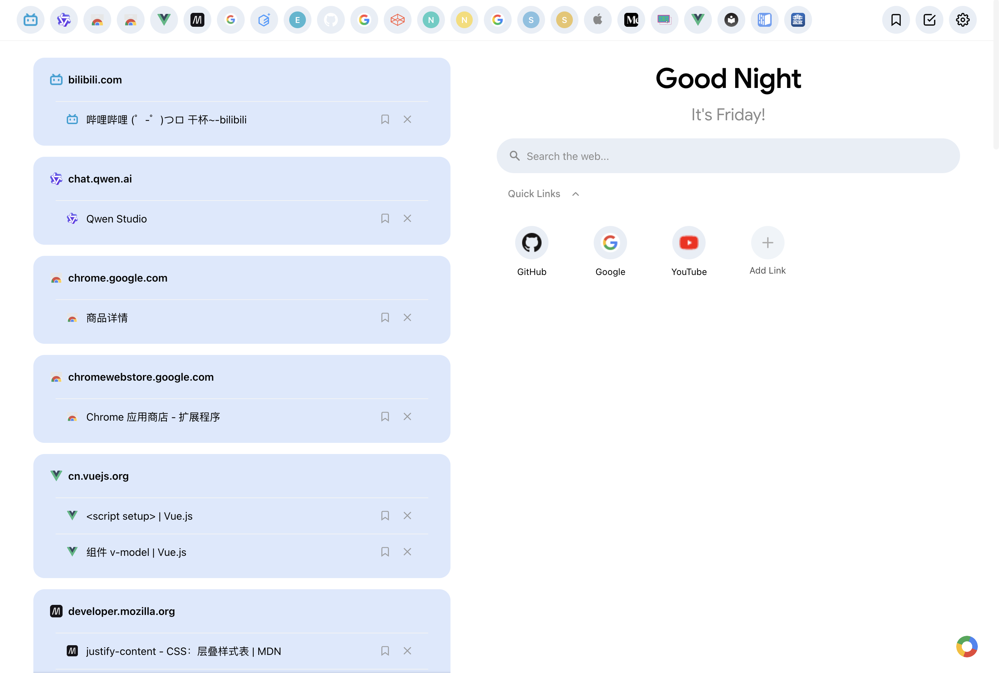
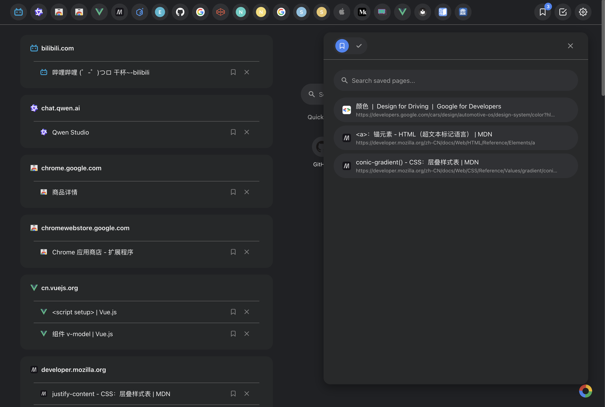
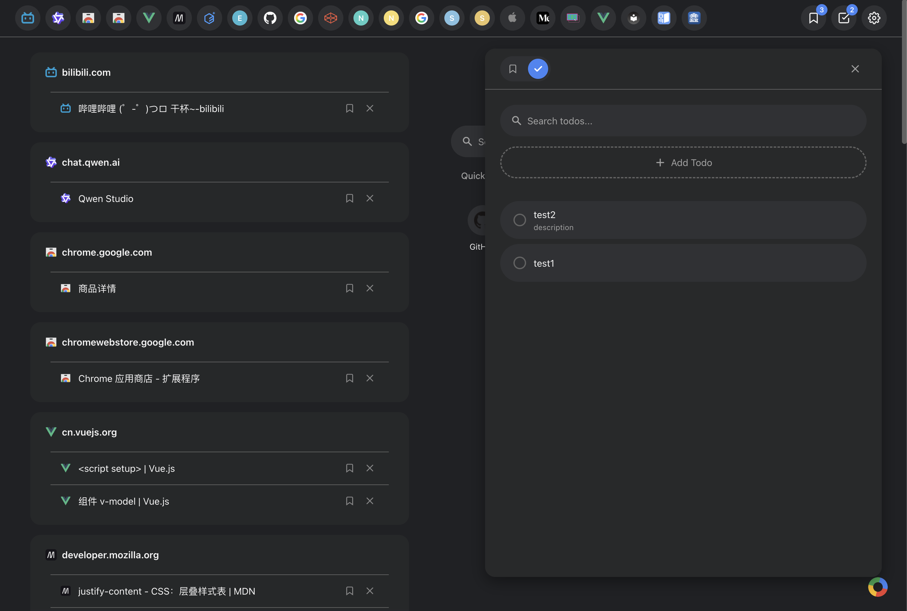

# Tab Harbor reVue

<div align="center">


**将您的浏览器标签页转变为一个整洁、有序的工作空间**

[功能特性](#-功能特性) • [快速开始](#-快速开始) • [开发指南](#-开发指南) • [项目结构](#-项目结构)

</div>

---

## 📖 概述

Tab Harbor reVue 是一个现代化的 Chrome 浏览器扩展，基于 [Tab Harbor](https://github.com/V-IOLE-T/tab-harbor) 重构而成。我们保留了原项目的核心功能，同时采用
Vue 3 + TypeScript 技术栈进行了全面升级，并引入了类似 Google Material Design 的清新界面风格。

通过智能的标签页分组、待办事项管理和快捷链接功能，帮助您提升工作效率，保持浏览器的整洁有序。

*该项目当前已发布到[chrome应用商店](https://chromewebstore.google.com/detail/tab-harbor-revue/cdeaffenjkejppkffbjjihcpnhpemefp)*

<table>
  <tr>
    <td width="33.33%" valign="top">
      <strong>统一管理标签页</strong><br><br>
      
    </td>
    <td width="33.33%" valign="top">
      <strong>暂存标签页</strong><br><br>
      
    </td>
    <td width="33.33%" valign="top">
      <strong>自由添加待办</strong><br><br>
      
    </td>
  </tr>
</table>

## ✨ 功能特性

### 📑 智能标签页管理

- **自动按域名分组** - 智能识别并自动将标签页按域名分类分组
- **快速搜索过滤** - 使用搜索栏实时过滤标签页，按 Enter 键使用默认搜索引擎搜索
- **一键清理** - 快速关闭多余或已读标签页（开发中）
- **手动分组** - 支持自定义创建和管理标签页分组（开发中）

### ✅ 高效待办事项

- **任务管理** - 轻松创建、编辑和删除待办任务
- **状态跟踪** - 通过复选框标记任务完成状态，自动排序更新的任务
- **优先级设置** - 支持任务置顶和手动拖拽排序，灵活调整任务优先级
- **详细描述** - 为每个任务添加详细的描述信息

### 🔗 快捷链接

- **常用网站** - 添加和管理常用网站的快捷访问方式，就像所有浏览器起始页那样
- **书签集成** - 快速访问浏览器书签（开发中）
- **个性定制** - 自定义快捷链接的显示和排序（开发中）

### ⏳ 延迟处理

- **稍后阅读** - 临时保存需要稍后处理的标签页，避免丢失重要内容
- **灵活排序** - 支持手动调整延迟项目的顺序，按需处理
- **智能提醒** - 提醒您处理已保存的延迟项目（开发中）

### 🎨 个性化主题

- **深色/浅色模式** - 支持系统主题自动切换和手动切换
- **多配色方案** - 提供多种精心设计的配色主题（开发中）
- **自定义背景** - 支持自定义背景图片和样式（开发中）

## 🚀 快速开始

### 安装扩展（推荐）

从 [Releases](https://github.com/HarryHello/tab-harbor-revue/releases) 页面下载最新版本：

1. 下载并解压最新版本的 ZIP 文件
2. 打开 Chrome 浏览器，访问 `chrome://extensions/`
3. 开启右上角的「开发者模式」
4. 点击「加载已解压的扩展程序」
5. 选择解压后的目录即可使用

或是从[chrome应用商店](https://chromewebstore.google.com/detail/tab-harbor-revue/cdeaffenjkejppkffbjjihcpnhpemefp)下载发布版本并自动更新。
（由于审核或其他原因，商店版本可能略有落后）

### 更新扩展

自`1.0.4`以后，在设置页面提供了导出和导入配置文件的选项。我们建议您在更新前导出配置文件，更新后如有缺失，可选择导入配置文件以覆盖。

暂存和待办的项目会一并导出。谨慎将配置文件发送给他人。

## 💻 开发指南

### 环境要求

- **Node.js**: ^20.19.0 或 >=22.12.0
- **npm**: 最新版本推荐

### 安装依赖

```bash
npm install
```

### 启动开发服务器

```bash
npm run dev
```

### 构建生产版本

```bash
npm run dev
```

开发服务器将在 `http://localhost:5173` 启动，支持热重载。

### 构建生产版本

```bash
npm run build
```

构建产物将输出到 `dist/` 目录，包含可直接加载的扩展文件。

### 预览构建结果

```bash
npm run preview
```

在本地预览生产构建的结果。

### 作为扩展加载

1. 运行 `npm run build` 构建项目
2. 打开 Chrome 浏览器，进入 `chrome://extensions/`
3. 开启右上角的「开发者模式」
4. 点击「加载已解压的扩展程序」
5. 选择项目根目录（包含 `manifest.json` 的目录）

> **提示**: 开发过程中可以直接加载未构建的项目目录，Vite 插件会自动处理热重载。

## 📁 项目结构

```
tab-harbor-revue/
├── extension/              # Chrome 扩展配置
│   ├── background.ts       # 后台脚本，处理扩展事件
│   └── manifest.json       # 扩展清单文件，定义权限和配置
├── public/                 # 静态资源目录
│   └── icons/              # 扩展图标（16px, 48px, 128px）
├── src/
│   ├── assets/             # 样式和资源文件
│   │   ├── animations.scss # 动画定义
│   │   ├── base.scss       # 基础样式
│   │   └── variables.scss  # SCSS 变量
│   ├── components/         # Vue 组件库
│   │   ├── common/         # 通用基础组件（按钮、开关、弹窗等）
│   │   ├── dashboard/      # 仪表盘主界面组件
│   │   ├── drawer/         # 侧边抽屉面板组件
│   │   ├── layout/         # 布局框架组件
│   │   ├── settings/       # 设置面板组件
│   │   └── tabs/           # 标签页展示组件
│   ├── stores/             # Pinia 状态管理
│   │   ├── tabs.ts         # 标签页状态和数据管理
│   │   ├── items.ts        # 待办事项和快捷链接管理
│   │   ├── theme.ts        # 主题和配色方案管理
│   │   └── settings.ts     # 用户偏好设置管理
│   ├── types/              # TypeScript 类型定义
│   ├── utils/              # 工具函数和辅助方法
│   ├── App.vue             # 应用根组件
│   └── main.ts             # 应用入口文件
├── vite.config.ts          # Vite 构建配置
├── tsconfig.json           # TypeScript 配置
└── package.json            # 项目依赖和脚本配置
```

## 🔧 核心技术栈

### 📌 标签页管理 (`stores/tabs.ts`)

负责浏览器标签页的状态同步和管理：

- 实时获取和更新标签页列表
- 按域名自动分组标签页
- 支持标签页搜索和过滤
- 提供标签页操作接口（激活、关闭、分组等）

### 📝 项目管理 (`stores/items.ts`)

统一管理用户的个人数据：

- 待办事项的 CRUD 操作和状态管理
- 延迟项目的保存和排序
- 快捷链接的添加和管理
- 数据持久化到 Chrome Storage

### 🎨 主题管理 (`stores/theme.ts`)

处理应用的视觉呈现：

- 深色/浅色模式切换逻辑
- 主题配色的动态应用
- 与系统主题的同步（可选）
- 自定义主题的支持（开发中）

### ⚙️ 设置管理 (`stores/settings.ts`)

保存和加载用户偏好：

- 界面显示选项（是否显示图标、动画等）
- 快捷键配置（开发中）
- 其他个性化设置

## 🔐 浏览器权限说明

本扩展遵循最小权限原则，仅请求必要的权限：

| 权限        | 用途                       |
|-----------|--------------------------|
| `tabs`    | 访问和管理浏览器标签页，实现标签页分组和搜索功能 |
| `storage` | 在本地存储用户数据（待办事项、快捷链接、设置等） |
| `search`  | 提供标签页内容的搜索能力             |

## 🤝 贡献指南

欢迎提交 Issue 和 Pull Request！

1. Fork 本仓库
2. 创建您的特性分支 (`git checkout -b feature/AmazingFeature`)
3. 提交您的更改 (`git commit -m 'Add some AmazingFeature'`)
4. 推送到分支 (`git push origin feature/AmazingFeature`)
5. 开启一个 Pull Request

## 📄 许可证

本项目采用 MIT 许可证 - 详见 [LICENSE](LICENSE) 文件
